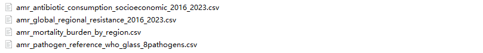
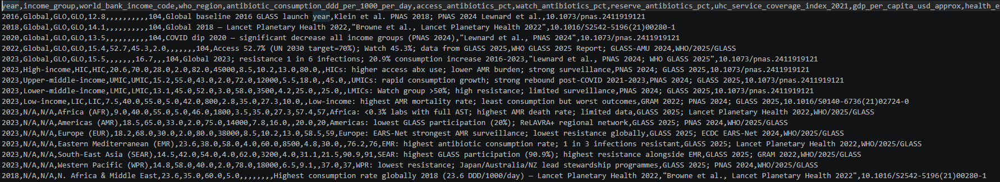
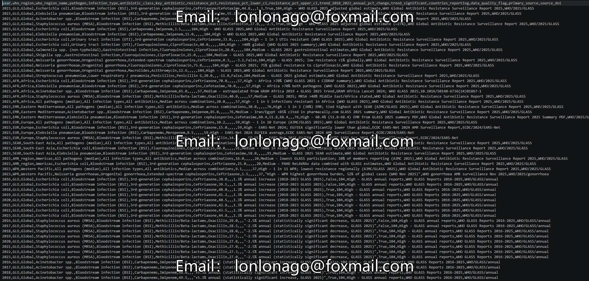
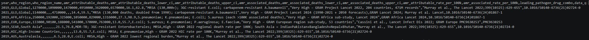
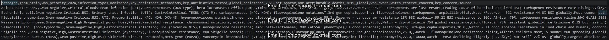

## Body

Global Antimicrobial Resistance (AMR): 2010-2023

Overview: Antimicrobial resistance (AMR) is one of the top ten public health threats globally identified by the World Health Organization. This dataset provides a multidimensional view of the AMR crisis, summarizing data from 2016 to 2023. It bridges the key gaps between antibiotic consumption, socioeconomic factors, and clinical resistance rates, offering comprehensive resources for epidemiological research and public health policy analysis.

Data Content: The dataset consists of four interconnected files, all sourced from the Global Surveillance Database (World Health Organization's Global Antimicrobial Resistance Monitoring System, GRAM Project, National Institutes of Health Research):

amr_antibiotic_consumption_socioeconomic_2016_2023.csv: Global and regional antibiotic consumption (DDD) linked to socioeconomic indicators and coverage of universal health coverage services.

amr_global_regional_resistance_2016_2023.csv: Time series resistance percentages for major pathogens (such as Escherichia coli, Pseudomonas aeruginosa) categorized by antibiotic classes.

amr_mortality_burden_by_region.csv: AMR attributable and related death estimates, including mortality rate per 100,000 people.

amr_pathogen_reference_who_glass_8pathogens.csv: Reference data on eight priority pathogens by the World Health Organization, including resistance mechanisms and global priority status.

Potential research directions include this dataset aiming to facilitate advanced analyses. Here are some entry points:

Correlation Analysis: Is higher antibiotic consumption (DDD) associated with rising resistance rates in specific regions of the World Health Organization?
Impact Assessment: Analyze changes in global antibiotic use patterns during the COVID-19 pandemic—whether these changes affected resistance trends?
Regional Burden Mapping: Visualize the highest AMR attributable mortality rates in WHO regions and identify the main pathogen-drug combinations driving these statistics.

Methodology
Data Aggregation: Data comes from high-quality sources, including the Global Antimicrobial Resistance and Use Monitoring System (GLASS) and the GRAM Project (The Lancet).
Units: Consumption measured in defined daily doses (DDD) per 1000 population per day; resistance measured in percentage of detected isolates.

Acknowledgments: This dataset relies on monitoring data provided by the World Health Organization (GLASS) and the GRAM Project Research Group. If using the data for academic publications, please cite the relevant source (DOI details in the 'source_doi' column).

## Images

Here is a pay link on Stripe ( https://buy.stripe.com/3cs8yP7sY87d0vu9AB ). Please contact me lonlonago@foxmail.com after funding $89, and I will send you a complete data files , thank you!

